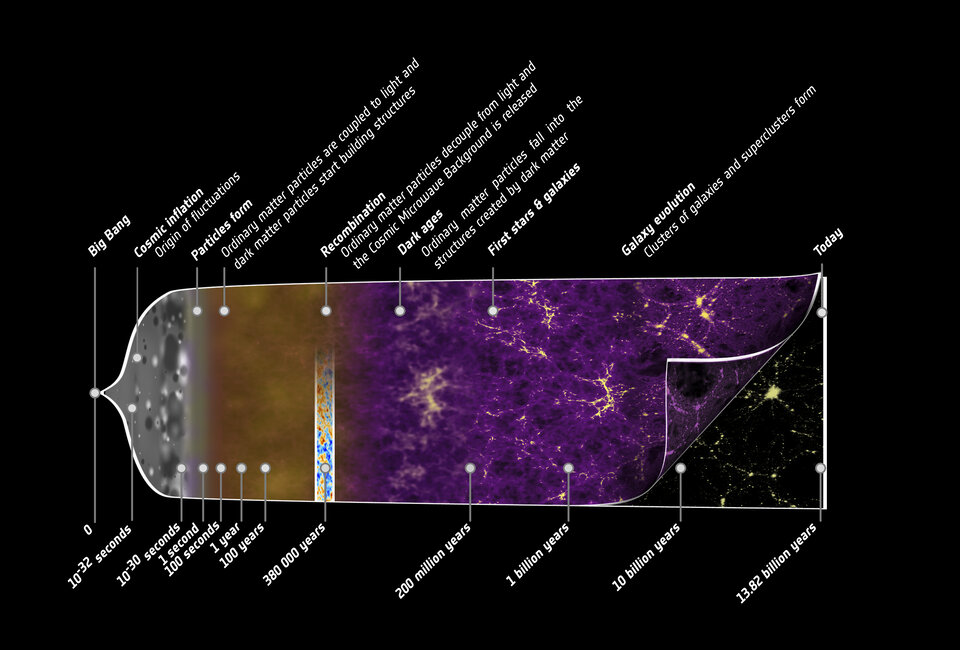

- Timeline: 
    - 14 billion years ago: Big Bang created space, time, and energy
    - 12-13 billion years ago to present: no fundamentally new astronomical objects have emerged
    - Hundreds of thousands years ago: people arose -- the antithesis of the universe's bland monotony
- Memes: (like genes) units of cultural transmission -- ideas, behaviors, and traditions that spread from person to person. Dawkins: what makes a meme die out isn't its benefit to its holders or society as a whole, it's the successful variant changes the behaviors of its holder in a way that makes it more likely to be passed on to others than its rivals.
- Static societies: e.g. 5 century BC Sparta of Ancient Greece 
    - Individuals who "offered" alternative memes punished or killed
    - Disable source of new ideas -- human creativity -- exploit childen's psychology to entrench themselves in their minds
- Dynamic societis: e.g. Athens during the "Golden Age" or "Age of Pericles" -- Plato and Aristotle 
    - Idea of Platonism and Idealism, and ideas about learning by studying and interacting emerged
    - Memes survived by criticism
- Enemies of Civilization:
    - Socialism: advocates centralized institutions to take means of production away from citizens, believe weath is fixed pie.
    - Environmentalism (or degrowth movement): advocates that humanity minimize its impact on the environment by having fewer children, consuming less energy, and releasing less carbon into the atmosphere
    -   Scientism: false idea that scientific knowledge trumps all other kinds of knowledge, that science can give us answers to all our questions
    -   Relativism: the idea that there is no difference between right and wrong, good and evil
    -   Dogmatism: idea that is considered, implicitly, or explicitly uncriticizable, the final truth, known with certainity, never to be changed
    -   Doomererism: idea that humanity has no shot at continuing to make progress, or that our extinction is just around the corner, we are just one innovation away from guaranteeing our decline
- Transformation that Nature allow for (including star becoming a black hole, heilum atoms fusing to become carbon and iron inside the star, particles or antiparticles colliding and producing high energy photons) << Transformation that life can cause (human genome alone can cause hundred thousand different proteins)
- Humans are the only species that can bring about any transformation that is allowed by the laws of physics. If there were a thing that we can't achieve no matter what knowledge we bring to bear, then there is another (testable) law of physics that says we can't do that.

<b>Knowledge Centered History of Everything</b>

 - First generation of stars produced mostly helium in their furnaces, but later generations of stars creater heavier, more complex elements in their nuclear fusion reactors, such as C, O, N, Fe. And when some stars died in violent explosions called supernovae, they vomitted their creations across the sky.
 - Abiogenesis: the origin of life -- a new seed that end the Great Monotony.
     - Some genes came together in a collaborative effort while each individual entity retained its identity.
     - World's first organisms formed this way -- boundary b/w catalysts inside and outside world
     - Key properties: compartmentalization, metabolisms, integrated software and hardware
 - Genes are like good explanation -- hard to vary while retaining functionality -- information causes itself to remain instantiated even as they migrate systems -- both are <i>knowledge</i>
     - Without knowldge universe was capable of small no. of objects -- dawn of knowledge -- "phase transition" -- diversity of physical systems increases exponentially
     - DNA produced more novelty than rest of the universe in billions of years -- every tooth and claw DNA produced is but a grain in the sand as compared with what genetic code is capable of producing
 - Endosymbiosysis: one prokaryotic cell swallowed the other, duo went onto replicate as a single unit -- more complex than either parent --> archae consuming a bacteria
 - Universal explainers: humans -- capable of explaining anything that can be explained, creating endless stream of knowledge, causing any physical transformation that laws of Nature allow for
 - There is only one kind of individual -- any person is capable of making progress, experiencing any physically possible qualia, and generating knowledge -- <i>egalitarianism</i> -- people are equal not in terms of skill, genes, interests, race, wealth, etc. but with respect to their ability to generate new knowledge and continuously solve endless stream of problems that define their lives
 - Computation is <i>substrate independent</i> -- the most fundamental properties and regularities that define computation do not depend on the particular hardware in which computation takes place
     - Turing developed an abstract machine (a-machine) that consisted of an infinite strip of tape divided into regular cells, a head that reads and writes symbols into the cell and moves left and right, and a state register that defines the a-machine's current state and determines the head's next move.
     - Conjectured "anything is computable by any algorithmic process can be computed by a Turing's machine"
     - It follows that if something can be computed by a Turing's machine, then nothing can execute the algorithm
     - Offered world's first theoritical model of a universal computer
 - Information is physical -- conforms to laws of Nature, much as atoms and life forms and stars do

<b>Our Open Future</b>
- Immortality
    - Evolution doesn't care about preventing death as long as the gene propagates across generations at the expense of rivals -- in the world of scarse resources, trade-offs are inevitable.
    - Glasses and cough syrups were not provided by genes or the Creator -- immortality is no different -- you don't have to die any more than you have to see poorly or learn to live with cough
- Artificial General Intelligence
    - We are precisely creative programs -- our brains are computer hardware and our minds are software who thoughts are nothing but computations -- we have seen computation is substrate independent
> AGI must be possible -- deep property of laws of physics + universality of computation. This entails everything that laws of physics require a physical object to do can, in principle, be emulated in arbitarily fine detail by some program on a general purpose computer, provided it is given enough time and memory ... it is plausible that just a single idea stands between us and the breakthrough. But it will have to be one of the best ever.
- Anarcho-capitalism
    - Creation of knowledge and weath requires the freedom for a mind to explore the space of ideas on its own terms, according to its own preferances
- Taking children seriously
    - 1) Parent child relationship, 2) relationship with self, 3) confusion about the problem, 4) confusion about how to solve the problem
- Universal Constructor
    - Universal computer: Ability to simulate the world around us and perform any computation that our imagination and laws of physics allow for
    - Cannot reproduce: confied to transformations and abstractions -- changing inputs bits into output bits
    - Could there be one that can replicate? Machines that transform raw materials into physical products
    - Universal constructor: need raw material and requisite program to create anything
    - Require knowledge of: chemistry, thermodynamics, computer science, economics, epistemology
