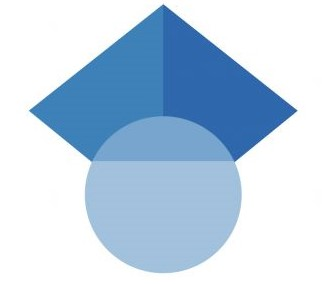

    

        
    

    

        Research Engineer 
        1x Technologies 
        sarthak.bhagat@1x.tech 
        
        
        
    

## News

- [Jan 26] [DreamControl](https://genrobo.github.io/DreamControl/) accepted to ICRA'26! Teaching humanoids to interact with scenes like humans do - diffusion meets whole-body control ([thread](https://x.com/sarthak__bhagat/status/1968742625369809366)).
- [Dec 25] Went back to where it all started - gave an AMA on robotics at IIIT Delhi. Full circle moment.
- [Nov 25] Joined [1x](https://www.1x.tech/) to work on robot manipulation with [NEO](https://www.1x.tech/neo). Excited to be building the future of humanoids.
- [Sept 25] Presented our General Robotics work at the Scaleup Summit in SF.
- [Aug 25] Teaching robots at SIGGRAPH'25 in Vancouver via [NVIDIA DLI](https://www.nvidia.com/en-us/on-demand/session/siggraph25-s13/). The irony of teaching humans to teach machines.
- [May 25] Our paper won best paper at [NoC Workshop](https://nocworkshop.github.io/2025/), ICRA'25! The reviewers were kind.
- [April 25] Got into Y Combinator Startup School. Learning from the best in the game.
- [March 25] At ICRA'25 in Atlanta - presenting work on predicting what humans will do before they do it.
- [Feb 25] GTC'25 in San Jose - where GPU nerds unite.
- [Dec 24] Co-developed [GRID](https://grid.generalrobotics.dev/)'s Isaac Sim integration - now powering 3000+ active users and multiple enterprise clients. Turns out robots need a playground too ([announcement](https://x.com/genrobotics_ai/status/1892250420711481524)).
- [Aug 24] Serving as a Program Committee Member at AAAI'25.
- [July 24] Paper on zero-shot task-oriented grasping via LLM-guided semantic part segmentation accepted as oral at IROS'24.
- [June 24] Joined [General Robotics](https://scaledfoundations.ai/) as employee #6. Building safe general robot intelligence from the ground up.
- [June 24] Officially a CMU Robotics grad! Two years flew by.
- [June 24] Work on predicting human actions for robot collaboration accepted to RA-L'24.
- [Dec 23] Reviewing papers for ICML'24, ICLR'24, and CoLLAs'24.
- [Sept 23] Two papers at ICCV'23 [CVEU workshop](https://cveu.github.io/) - one on predicting actions, one on making faces talk. Also got to see Paris!
- [Sept 23] Student volunteer at ICCV'23.
- [May 23] Selected among 200 researchers for [Heidelberg Laureate Forum](https://www.heidelberg-laureate-forum.org/forum/10th-hlf-2023.html). Got to meet Turing and Fields Medal winners!
- [May 23] Oral presentation at [CoLLAs'23](https://lifelong-ml.cc/Conferences/2023/venue) - 12 orals out of all submissions. Teaching robots to learn concepts like humans do.
- [Dec 22] Best Demo Paper at ACM MM Asia'23 for our talking face generation work. The judges liked our digital puppets.
- [Sept 22] Started research at AART Lab, CMU. Teaching robots to understand humans better.
- [Aug 22] Landed at CMU Robotics Institute. Dream school, dream program.
- [Jan 22] Joined [Preimage](https://www.preimage.ai/) - reconstructing 3D scenes from just a handful of drone images.
- [Oct 20] Started at [CLVR Lab](https://www.clvrai.com/), USC with Joseph Lim. Robots that don't forget old tricks when learning new ones.
- [Aug 20] Research assistant at [DeCLaRe Lab](https://declare-lab.net/), SUTD - teaching machines to see and read at the same time.
- [Aug 20] Graduated from [IIIT-Delhi](https://www.iiitd.edu.in/) with Honors. Four years, many all-nighters, worth it.
- [Aug 19] Dean's Award for Academic Performance - 4 semesters in a row.
- [Aug 19] Dean's Award for Innovation, R&D for my Bachelor's thesis.
- [May 19] Summer at SUTD Brain Lab in Singapore - untangling the mess inside video data with Gaussian processes.
- [May 19] [INAE Fellowship](https://www.inae.in/#) from IISc.
- [Aug 18] 6th out of 70 international teams at [AUVSI SUAS](https://suas-competition.org/) in Maryland. Our drone didn't crash!
- [Aug 16] Chairman's Merit Scholarship - top 4 out of 278 students.
- [May 15] KVPY Fellowship - top 0.3% of applicants. The exam that started it all.

    <a nohref>Read more</a>

## How I Got Here

<!-- I am a research engineer at <a href="https://www.generalrobotics.company/">General Robotics</a>, where I work on advancing robot intelligence using machine learning, making robots safer and more efficient. I focus on skill learning for robotics, enabling advanced sensing, reasoning, and action capabilities for productive and safe robot operation. I lead sim2real reinforcement learning efforts (<a href="https://www.generalrobotics.company/post/general-purpose-intelligence-for-every-robot">1</a>), skill learning for arms, humanoids (<a href="https://www.generalrobotics.company/post/dreamcontrol-building-humanoid-ai-skills">2</a>), and quadrupeds in IsaacSim (<a href="https://x.com/genrobotics_ai/status/1892250420711481524">3,</a> <a href="https://x.com/NVIDIARobotics/status/1910102079818936647">4</a>) and technical customer engagements. I was the <i>7th employee</i> at the company and the <i>first hire for the robotics team</i>.

I graduated with a MS in Robotics from <a href="https://www.ri.cmu.edu/">the Robotics Institute</a>, <a href="https://www.cmu.edu/">Carnegie Mellon University</a>.
Here, I worked at <a href="https://www.ri.cmu.edu/robotics-groups/advanced-agent-robotics-technology-lab/">Advanced Agents - Robotics Technology Lab</a> advised by <a href="https://en.wikipedia.org/wiki/Katia_Sycara">Dr. Katia Sycara</a>. <a href="https://www.ri.cmu.edu/app/uploads/2024/06/Sarthak_MSR_Thesis.pdf">My Master's thesis</a> involved improving robotic perception and interaction through structured domain knowledge priors.

 Before joining CMU, I was a deep learning research engineer at <a href="https://preimage.ai/">Preimage</a>, where I specialized in problems involving 3D vision for drone-based photogrammetry.
Previously, I worked as a visiting researcher at <a href="https://www.clvrai.com/">Cognitive Learning and Vision for Robotics (CLVR) Lab</a> (USC) with <a href="https://clvrai.com/web_lim/">Dr. Joseph Lim</a>. My work there centered on the adaptation of policies to novel unseen environments and continual learning of skills.

I graduated with my B.Tech (with Honors) from <a href="https://www.iiitd.ac.in/">IIIT-Delhi</a>. I completed my <a href="https://www.researchgate.net/profile/Sarthak-Bhagat/publication/346983991_Geometry_of_Neural_Network_based_Disentangled_Latent_Space_Models/links/5fd74b4445851553a0b59699/Geometry-of-Neural-Network-based-Disentangled-Latent-Space-Models.pdf">Bachelor's thesis</a> under <a href="http://faculty.iiitd.ac.in/~anands/">Dr. Saket Anand</a> in collaboration with <a href="https://pavanturaga.com/">Dr. Pavan Turaga</a> (Arizona State University). My thesis involved unsupervised representation learning to disentangle multiple factors of variation in images. 
I also interned at the <a href="https://sutdbrain.wordpress.com/about/">SUTD Brain Lab</a> where I worked on the disentanglement of video sequences using Gaussian processes. Additionally, I spent some time working with <a href="https://moonlab.iiserb.ac.in/people.html">Dr. P.B. Sujit</a> on target tracking using deep reinforcement learning. During my undergrad, I was also a part of the autonomous driving team, <a href="https://sites.google.com/iiitd.ac.in/iiitd-alive/home">ALIVE (formerly Swarath)</a> (demonstration of our vehicle in action available <a href="https://youtu.be/Oei8r27vscQ?si=5WRmf-hmvOrOGMQk">here</a>). -->

    

        

        
2024 - Present

        

            
Research Engineer, <a href="https://www.1x.tech/">1x Technologies</a>

            <ul class="timeline-details">
                <li>Reinforcement learning for manipulation with <a href="https://www.1x.tech/neo">NEO</a></li>
                <li>Contributor to Redwood AI (<a href="https://www.1x.tech/discover/redwood-mobility">blog</a>) - our end-to-end VLA-driven mobile manipulation stack</li>
                <li>1x World Model (<a href="https://www.1x.tech/discover/world-model-self-learning">blog</a>)</li>
            </ul>
        

    

    

        

        
2024 - 2025

        

            
Founding Research Engineer, <a href="https://www.generalrobotics.company/">General Robotics</a>

            <ul class="timeline-details">
                <li>Employee #6, first hire for the robotics team</li>
                <li>Led sim2real RL efforts (<a href="https://www.generalrobotics.company/post/general-purpose-intelligence-for-every-robot">blog</a>), co-led Isaac Sim integration into <a href="https://grid.generalrobotics.dev/">GRID</a> (<a href="https://www.generalrobotics.company/post/general-robotics-integrates-nvidia-isaac-sim-into-grid">blog</a>)</li>
                <li>Humanoids (<a href="https://www.generalrobotics.company/post/dreamcontrol-building-humanoid-ai-skills">blog</a>), quadrupeds, arms (<a href="https://x.com/genrobotics_ai/status/1947357457229164729">post</a>), agents (<a href="https://www.generalrobotics.company/post/agentic-robotics">blog</a>)</li>
            </ul>
        

    

    

        

        
2022 - 2024

        

            
Master's in Robotics, CMU

            <ul class="timeline-details">
                <li>Improving robotic perception and interaction using domain knowledge (<a href="https://www.ri.cmu.edu/publications/enhancing-robot-perception-and-interaction-through-structured-domain-knowledge/">thesis</a>, advisor: <a href="https://en.wikipedia.org/wiki/Katia_Sycara">Dr. Katia Sycara</a>)</li>
            </ul>
        

    

    

        

        
2021 - 2022

        

            
Deep Learning Research Engineer, <a href="https://preimage.ai/">Preimage</a>

            <ul class="timeline-details">
                <li>Reconstructing 3D scenes from sparse drone images</li>
            </ul>
        

    

    

        

        
2020 - 2021

        

            
<a href="https://www.clvrai.com/">CLVR Lab</a>, USC

            <ul class="timeline-details">
                <li>Adapting robot policies to new environments without forgetting old skills (advisor: <a href="https://clvrai.com/web_lim/">Dr. Joseph Lim</a>)</li>
            </ul>
        

    

    

        

        
2019 - 2020

        

            
SUTD Brain Lab

            <ul class="timeline-details">
                <li>Disentangling video sequences using Gaussian processes (<a href="https://link.springer.com/chapter/10.1007/978-3-030-58592-1_7">paper</a>)</li>
            </ul>
        

    

    

        

        
2016 - 2020

        

            
B.Tech (with honors), IIIT Delhi

            <ul class="timeline-details">
                <li>Disentangling factors of variation in images (<a href="https://www.researchgate.net/profile/Sarthak-Bhagat/publication/346983991_Geometry_of_Neural_Network_based_Disentangled_Latent_Space_Models/links/5fd74b4445851553a0b59699/Geometry-of-Neural-Network-based-Disentangled-Latent-Space-Models.pdf">thesis</a>, advisors: <a href="http://faculty.iiitd.ac.in/~anands/">Dr. Saket Anand</a> and <a href="https://pavanturaga.com/">Dr. Pavan Turaga</a>)</li>
                <li>Target tracking with deep RL (<a href="https://ieeexplore.ieee.org/abstract/document/9213856">paper</a>), autonomous driving team <a href="https://sites.google.com/iiitd.ac.in/iiitd-alive/home">ALIVE</a> (<a href="https://youtu.be/Oei8r27vscQ?si=5WRmf-hmvOrOGMQk">demo</a>)</li>
            </ul>
        

    

Interested in collaborating, advice, or chatting? Drop me an email at <a href="mailto:sarthakbhagatoutreach@gmail.com">sarthakbhagatoutreach@gmail.com</a>.

  

<!-- 

    

        

            
            
        

        

            IIIT Delhi 
            2016 - 2020
        

    

    

        

            
            
        

        

            SUTD 
            Summer 2019, 2020
        

    

    

        

            
            
        

        

            University of Southern California 
            2020 - 2021
        

    

    

        

            
            
        

        

            Preimage 
            2021
        

    

    

        

            
            
        

        

            Carnegie Mellon University 
            2022-
        

    

 -->

<!-- 
[1]: //mlp.cc.gatech.edu
[2]: ///www.cc.gatech.edu/~dbatra/
[3]: //www.cc.gatech.edu/~parikh/
[4]: //www.qbi.uq.edu.au/professor-geoffrey-goodhill
[5]: //researchers.uq.edu.au/researcher/2490
[6]: http://cns.qbi.uq.edu.au/
[7]: //developers.google.com/open-source/gsoc/
[8]: /posts/summer-of-code/
[9]: /posts/gsoc-reunion-2014/
[10]: //blog.sdslabs.co/2012/09/hacku
[11]: //blog.sdslabs.co/2014/02/code-fun-do
[12]: //www.facebook.com/SDSLabs/posts/527540147292475
[13]: /posts/deloitte-cctc-3/
[14]: /posts/google-india-community-summit/
[15]: //blog.sdslabs.co/2013/10/syntax-error-2013
[16]: //sdslabs.co/
[17]: //erdos.sdslabs.co/
[18]: //projecteuler.net/
[19]: //github.com/abhshkdz/neural-vqa
[20]: //github.com/abhshkdz/HackFlowy
[21]: //github.com/abhshkdz/graf
[22]: //github.com/abhshkdz
[23]: //twitter.com/abhshkdz
[24]: //instagram.com/abhshkdz
[25]: http://x.abhishekdas.com/
[26]: https://abhishekdas.com/vqa-hat/
[27]: http://arxiv.org/abs/1606.03556
[28]: https://www.newscientist.com/article/2095616-robot-eyes-and-humans-fix-on-different-things-to-decode-a-scene/
[29]: https://www.technologyreview.com/s/601819/ai-is-learning-to-see-the-world-but-not-the-way-humans-do/
[30]: http://www.theverge.com/2016/7/12/12158238/first-click-deep-learning-algorithmic-black-boxes
[31]: http://iitr.ac.in/
[32]: https://www.facebook.com/dhruv.batra.1253/posts/1783087161932290
[33]: https://drive.google.com/file/d/1nObeNzl-sTy8I5QN1Jv8wscebKLv-6RY/view?usp=sharing
[34]: http://aideadlin.es/
[35]: //github.com/abhshkdz/neural-vqa-attention
[36]: https://snapresearchfellowship.splashthat.com/
[37]: https://www.youtube.com/watch?v=R4hugGnNr7s
[38]: https://www.youtube.com/watch?v=I9OlorMh7wU
[39]: https://adoberesearch.ctlprojects.com/fellowship/previous-fellowship-award-winners/
[40]: https://embodiedqa.org/
[41]: https://youtu.be/KAlGWMJnWyc?t=26m56s
[42]: https://2018gputechconf.smarteventscloud.com/connect/sessionDetail.ww?SESSION_ID=152715
[43]: https://www.ic.gatech.edu/news/600684/three-ic-students-earn-snap-research-awards
[44]: https://www.ic.gatech.edu/news/601084/new-research-fellowships-offer-two-students-funding-access-adobes-creative-cloud
[45]: https://github.com/facebookresearch/House3D
[46]: https://gkioxari.github.io/
[47]: https://research.fb.com/people/parikh-devi/
[48]: https://research.fb.com/people/batra-dhruv/
[49]: https://lvatutorial.github.io/
[50]: http://acl2018.org/tutorials/#connecting-language-and-vis
[51]: http://visualqa.org/workshop.html
[52]: http://on-demand.gputechconf.com/gtc/2018/video/S8582/
[53]: https://visualdialog.org/challenge/2018
[54]: https://youtu.be/gz2VoDrvX-A?t=1h19m58s
[55]: https://research.fb.com/people/rabbat-mike/
[56]: https://www.cs.mcgill.ca/~jpineau/
[57]: https://visualdialog.org/challenge/2018#winners
[58]: https://www.youtube.com/watch?v=xoHvho-YRgs&t=7330
[fb-fellow-page]: https://research.fb.com/announcing-the-2019-facebook-fellows-and-emerging-scholars/
[joelle-corl18-talk-mention]: https://www.youtube.com/watch?v=FSsEqEJKo8A&t=3497
[visdial-challenge-2]: https://visualdialog.org/challenge/2019
[ic-gt-article]: https://www.ic.gatech.edu/news/617061/see-and-say-abhishek-das-working-provide-crucial-communication-tools-intelligent-agents
[caliper]: https://caliper.ai
[felix-hill]: https://fh295.github.io
[laura-rimell]: http://www.rimell.cc/laura/
[stephen-clark]: https://sites.google.com/site/stephenclark609/
[andrej-karpathy]: https://karpathy.ai/
[vigil19]: https://vigilworkshop.github.io/2019
[tarmac-icml-talk]: https://www.facebook.com/icml.imls/videos/444326646299556/
[mastodon]: https://mastodon.social/web/accounts/1011404
[conquerearth]: https://conquer.earth/abhshkdz
[qa-probing-icml20-talk]: https://slideslive.com/38928261/probing-emergent-semantics-in-predictive-agents-via-question-answering
[vigil20]: https://vigilworkshop.github.io
[ocp]: https://opencatalystproject.org
[ocp-cnbc]: https://www.cnbc.com/2020/10/14/facebook-to-use-ai-in-bid-to-improve-renewable-energy-storage.html
[ocp-engadget]: https://engadget.com/facebook-deploys-its-ai-to-find-green-energy-storage-solutions-130041147.html
[ocp-fortune]: https://fortune.com/2020/10/14/facebook-ai-open-catalyst-dataset-chemistry-renewable-energy/
[ocp-venturebeat]: https://venturebeat.com/2020/10/14/facebook-and-carnegie-mellon-launch-project-to-discover-better-ways-to-store-renewable-energy/
[aipaygrad.es]: https://aipaygrad.es
[sigma-xi-thesis-award]: https://cpb-us-w2.wpmucdn.com/sites.gatech.edu/dist/0/283/files/2021/03/2021-Sigma-Xi-Research-Award-Winners.final_.pdf
[coc-dissertation-award]: https://sites.gatech.edu/gtcomputingawards2021/graduate-student-awards/
[thesis-pdf]: https://drive.google.com/file/u/2/d/1b2Gonazl1Os0eLPV9frkucEqSuRroEvD/view?usp=sharing
[aaai-dissertation-award]: https://aaai.org/Awards/dissertation-award.php -->
